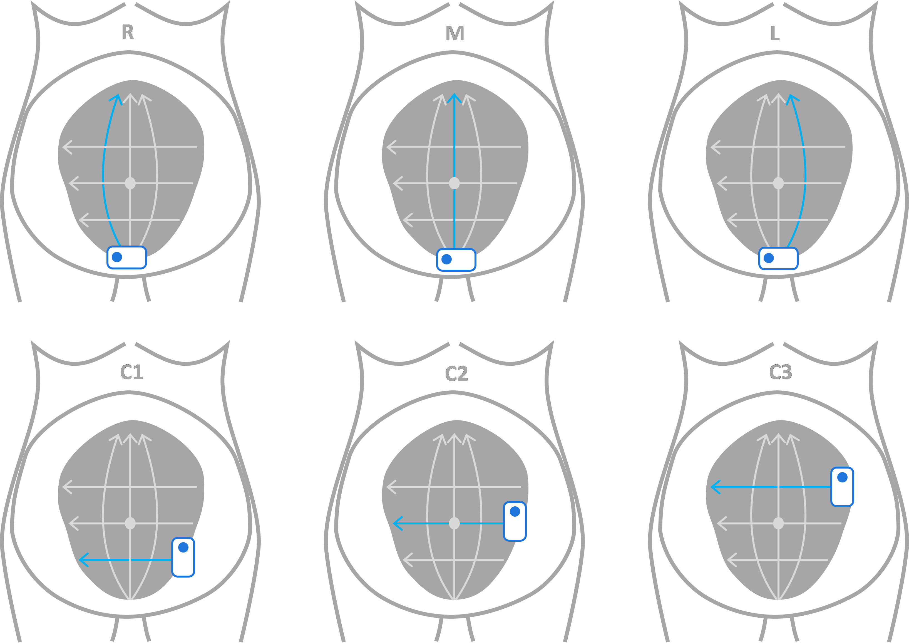

# README.md
Authors: 
* Courosh Mehanian ( courosh at gmail dot com)
* Daniel Shea (shea dot dan at gmail dot com)

This software is licensed under the MIT license. See LICENSE.txt in the root of
the repository for details.

# 1. Introduction
This starter package for AI-enabled obstetric ultrasound (OBUS) was prepared by the
Global Health Labs (GHL) machine learning team. This package is based on the FAMLI 
datasets collected by the University of North Carolina at Chapel Hill (UNC) for 
training and evaluating AI models for antenatal care [^1].

# 2. Overview of the OBUS-GHL Project
The goal of the OBUS-GHL project is to develop AI models that can assist in the
interpretation of obstetric ultrasound videos. The project focuses on four key 
obstetric features:

#### Table 1. Obstetric Features and Models
| Model  | Task Description                  |
|--------|-----------------------------------|
| `GA`   | Gestational Age estimation        |
| `FP`   | Fetal Presentation classification |
| `EFW`  | Fetal Weight Estimation           |
| `TWIN` | Multiple Gestation classification |

The overarching goal is to create models that can accurately predict these features 
from blind sweep ultrasound videos. In low resource settings, the expertise to acquire 
specialized ultrasound images or to interpret them is either lacking or in short 
supply. Therefore, to improve maternal and fetal health outcomes in these settings, 
the AI models should be able to make interpretations on blind sweeps that can be 
acquired by nurses and midwives with minimal sonographic training (< 1 day).

# 3. Overview of the FAMLI Datasets
The FAMLI datasets are a collection of obstetric ultrasound videos collected by UNC
at clinics and hospitals in North Carolina and Zambia. The data was collected in phases 
from 2018, and `FAMLI3` data continues to be collected as of 2025-04.

#### Table 2. Datasets associated with the FAMLI project
| Dataset Name      | Dates                   |
|-------------------|-------------------------|
| `FAMLI2_enrolled` | 2018-09 through 2022-05 |
| `FAMLI2`          | 2022-06 through 2023-05 |
| `FAMLI3`          | 2023-06 through 2025-04 |

The OBUS-GHL code base was developed and tested with data collected through 2025-04, 
but it is expected to work with future data that are collected, as long as the 
protocols and metadata tables remain consistent.

The FAMLI datasets are divided into three main subsets: `FAMLI2_enrolled`, `FAMLI2`,
and `FAMLI3`. As of 2025-04, the datasets altogether comprise thousands of patients and 
exams, and hundreds of thousands of ultrasound videos. A highly curated subset of 
`FAMLI2_enrolled` data, referred to as the `NEJM` dataset, was used by UNC to develop 
their own AI models, which they published in the New England Journal of Medicine [^2]. 
GHL trained and evaluated two of the obstetric features, `GA` and `FP`, on the NEJM 
dataset, utilizing the training, validation, and testing splits defined by UNC. GHL 
trained and evaluated the other two obstetric features, `EFW` and `TWIN`, on the 
entire `FAMLI2_enrolled`, `FAMLI2`, and `FAMLI3` datasets. For each of the latter two 
features, GHL defined the training, validation, and testing splits independently of UNC.

## 3.2. Clinic, Study, Exam, and Instance
The OBUS-GHL repository necessarily adopted some of the nomenclature that is inherent 
in the FAMLI datasets by virtue of the metadata tables provided. The current document 
defines the existing terms and creates new terms that hopefully clarify the intent. 

The following table shows the clinics where data for the FAMLI datasets was collected:

#### Table 3. Clinics and their IDs
| Clinic ID | Location       | Dataset-specific notes                   |
|-----------|----------------|------------------------------------------|
| FAM-025   | Zambia         | FA3-025 for `FAMLI3`                     |
| FAM-111   | Zambia         | FA3-111 for `FAMLI3`                     |
| FAM-202   |         Zambia | FA3-202 for `FAMLI3`                     |
| FAM-300   |         Zambia | FA3-300 for `FAMLI3`                     |
| UNC       | North Carolina | `NEJM`, `FAMLI2_enrolled`, `FAMLI2` only |
| VIL       | North Carolina | `NEJM`, `FAMLI2_enrolled`, `FAMLI2` only |

Each patient is assigned a unique patient identifier (`PID`), which consists of the 
clinic identifier followed by a unique patient number, e.g., FAM-025-9999 (hypothetical).

The term `study` refers to an enrolled patient's visit to a clinic or hospital on a 
particular day for data collection. The study identifier (`StudyID`) is formed by 
sequentially appending an integer to the patient identifier, e.g., FAM-025-9999-1, 
FAM-025-9999-2, etc.

The term `exam` refers to a collection of ultrasound videos collected from a pregnant 
mother on the same day, at the same clinic, with the same device, and by the same 
clinician. Multiple exams may have occurred during a patient visit (study), either by 
using an alternative device or when a different clinician collected the data. The 
exams were collected by either sonographers and physicians or nurses and midwives. The 
exams collected by nurses and midwives are referred to as novice exams, while those 
collected by sonographers and physicians are referred to as expert exams. Novice exams 
were always collected with a Butterfly iQ, iQ+, or iQ3 device, while expert exams could 
have been collected with any device. Exams are assigned an identifier by appending a 
string that uniquely identifies the particular exam on a given visit. There are two 
different methods for constructing the exam identifier, which will be elaborated below 
when the ingestion process is described.

The term `instance` refers to a single ultrasound data sample. The instance can be a 
video (sometimes called a loop) or a still image. The OBUS-GHL project only makes use of 
ultrasound videos, so instance is synonymous with an ultrasound video in this context. 
There are three classes of ultrasound videos in the FAMLI datasets: diagnostic, 
biometric, and blind sweeps. Every video is assigned a tag that indicates the sweep 
type. There are six canonical blind sweeps as shown in the following diagram:

#### Figure 1. Canonical Blind Sweeps

This diagram shows the canonical set of blind sweeps that should be part of every exam. 
In reality, the actual sweep types in an exam often differ and frequently include 
more (or occasionally fewer) vertical sweeps and frequently more (or occasionally fewer) 
horizontal sweeps. Sweep tags are used to identify the sweep type of each video. 
Outside the highly curated NEJM dataset, the sweep tags are sometimes missing. The GHL 
team dealt with missing tags by processing the upper left corner (where the tag is 
usually expected to be) of the 5th image frame of videos with missing tags with a 
vision language model to identify the sweep type. The GHL team also corrected some of 
the sweep tags by manual inspection. The corrected sweep tags are stored in a file 
which is used during the ingestion process, described below. The AI models are 
trained mostly on, and evaluated entirely on, blind sweep videos. Sweep tags with an 
initial letter N refer to novice sweeps.

## 3.3. Blind sweeps
The full set of blind sweep tags in the FAMLI datasets are listed in Table 4.

#### Table 4. Vertical and horizontal blind sweep tags
| tag   | description         | aliases or additional sweeps                   |
|-------|---------------------|------------------------------------------------|
| M     | vertical-middle     | M0, M1, NM                                     |
| L     | vertical-left       | L0, L1, L2, L3, L15*, ML*, L45*, NL, NL0, NL1  |
| R     | vertical-right      | R0, R1, R2, R3, R15*, MR*, R45*, NR, NR0, NR1  |
| C     | horizontal-central  | C1, C2, C3, C4, C5, C6, NC, NC1, NC2, NC3, NC4 |
| ASSBS | assumed-blind-sweep | None                                           |
| RTA   | right-transverse    | FA1, RTB, RTC, FA2                             |
\* Refer to note in paragraph below.

For the vertical sweeps, the transducer is held in a transverse plane and swept up 
from the pubic bone to the uterine fundus. For the horizontal sweeps, the transducer is 
held in a vertical plane (except for starred sweeps in the table above) tangent to the 
abdomen, sweeping from maternal left to right, at increasing heights from the pubic 
bone. Sweeps L15/ML are swept vertically, but the transducer is rotated 15 degrees to 
the maternal left. For sweep L45, the transducer is rotated 45 degrees to the maternal 
left. Sweeps R15/MR are swept vertically, but the transducer is rotated 15 degrees to 
the maternal right. For sweep R45, the transducer is rotated 45 degrees to the 
maternal right [^3].

## 3.4. Biometric sweeps
Biometric sweeps are ultrasound videos that are collected with the intent of measuring
fetal anatomy parameters, as indicated in the table below. The biometric videos are 
often fly-to videos, where the transducer is moved to standard measurement plane while 
recording. Traditionally, biometric parameters are measured from still ultrasound 
images that require a great deal of expertise to acquire. These traditional biometric 
images do exist in the dataset, and they were used to establish `GA` and `EFW` ground 
truth. But the still images were not used in the development of AI models.

The full set of biometric sweep tags in the FAMLI datasets is shown in Table 5. For 
multiple gestation pregnancies, the biometric sweep tags are suffixed with a letter 
indicating which fetus it was measured on, e.g., `BPDA` for the first fetus, `BPDB` 
for the second fetus, etc.

#### Table 5. Biometric sweep tags
| tag | description              | additional tags  |
|-----|--------------------------|------------------|
| GS  | gestational sac          | None             |
| YS  | yolk sac                 | None             |
| CRL | crown-rump length        | CRL1, CRL2, CRL3 |
| BPD | biparietal diameter      | BPD1, BPD2, BPD3 |
| HC  | head circumference       | HC1, HC2, HC3    |
| AC  | abdominal circumference  | AC1, AC2, AC3    |
| FL  | femur length             | FL1, FL2, FL3    |
| HL  | humerus length           | HL1, HL2, HL3    |
| TCD | transcerebellar diameter | TCD1, TCD2, TCD3 |

## 3.5. Diagnostic Sweeps
The diagnostic videos in the FAMLI datasets are specialized ultrasound videos that are 
used by experts to diagnose and measure fetal, maternal, and placental conditions, 
such as fetal heart rate, umbilical blood flow, amniotic fluid volume, fetal position 
and orientation, and placental location. These videos have their own sets of tags 
(not discussed here) and were not used in the development of AI models.

# 4. Code Repository Structure
The OBUS-GHL code repository is organized into several directories, each of which 
contains modules for the various stages and tasks that are involved in curating 
the FAMLI datasets, and training and evaluating AI models. Table 6 shows the code 
directories and explains their purpose.

#### Table 6. Code Directory Structure
| Directory Name | Purpose                                          |
|----------------|--------------------------------------------------|
| `ingestion`    | Data ingestion scripts                           |
| `data`         | Data modules for training and inference          |
| `training`     | Training scripts and configuration files         |
| `inference`    | Inference scripts and configuration files        |
| `models`       | PyTorch deep learning modules                    |
| `callbacks`    | Callback modules for inference                   |
| `utilities`    | Utility methods for processing and visualization |

More detail will be provided about each of these directories in the sections below.

# 5. Data Ingestion
Data ingestion is the process of curating and preprocessing the FAMLI datasets for 
machine learning model development. The ingestion process involves several steps, 
which includes extracting relevant metadata from the tabular data associated with the 
ultrasound videos, merging the exam-level metadata with the video tables, and 
preprocessing the ultrasound videos into PyTorch tensor files. The ingestion process 
also filters out videos not used for machine learning (such as the diagnostic sweeps 
mentioned above), taking advantage of the sweep tags when available. The final step of 
data ingestion is to create training, validation, and testing splits for machine 
learning model development. 

## 5.1 FAMLI Data Ingestion Processes

There are two data ingestion processes in the OBUS-GHL project as shown in Table 7. 
Ingestion process `v4` was implemented early in the project and is used for the `GA` 
and `FP` obstetric features. Ingestion process `v9` is the latest and is used for the 
`EFW` and `TWIN` obstetric features.

#### Table 7. Ingestion Processes
| Ingestion Process | Target Features  | Datasets                                  |
|-------------------|------------------|-------------------------------------------|
| `v4` ingestion    | `GA` and `FP`    | `NEJM` subset of `FAMLI2_enrolled`        |
| `v9` ingestion    | `EFW` and `TWIN` | `FAMLI2_enrolled`, `FAMLI2`, and `FAMLI3` |

Auxiliary outputs of both ingestion processes are spreadsheets that list the 
individual ultrasound videos (instances) with their associated metadata, which are 
to be fed to the machine learning models. These spreadsheets are referred to as 
distributions, and they contain various metadata columns. There are four categories of 
metadata columns in the distributions: canonical, ingestion-generated, 
feature-specific, and analysis columns. These are listed in Table 8.

#### Table 8. Metadata Columns in Distributions
| Category  | Example Column Names                                                               |
|-----------|------------------------------------------------------------------------------------|
| Canonical | `PID`, `StudyID`, `filename`, `tag`,   `Manufacturer`, `ManufacturerModelName` |
| Ingestion | `exam_dir`, `file_type`, `outpath`,    `relpath`, `orig_frames`, `orig_height` |
| Feature   | `ga_boe`, `log_ga_boe`, `lie`, `TWIN`,    `AC`, `HC`, `FL`, `BPD`, `EFW`       |
| Analysis  | `softmax_pos_class`, `softmax_neg_class`                                           |

## 5.2. Data Ingestion `v4`
This section provides a detailed explanation of the `v4` ingestion process, including 
the necessary scripts, data files, and steps to curate and preprocess the data. The 
`v4` ingestion process converts the raw `NEJM` data into preprocessed data files and 
creates output spreadsheets. The raw `NEJM` data consists solely of DICOM ultrasound  
video files without a file extension.

### 5.2.1. Ingestion `v4` process steps
1. `merge_instance_exam_v4.py` merges the `NEJM` instance table with the `NEJM` exam 
   metadata table to create a consolidated instance table with exam-level metadata. 
   In `v4` the exam identifier is based on the study identifier. If the exam was 
   performed by an expert with a Butterfly iQ device, "-butterfly" is appended to the 
   study identifier, e.g., FAM-025-9998-1-butterfly (hypothetical). If the exam was 
   performed by a novice with a Butterfly iQ device, "-novice-butterfly" is appended 
   to the study identifier, e.g., FAM-025-9997-1-novice-butterfly (hypothetical).
2. `preprocess_data_v4.py` performs the following steps (carried out separately for 
   each of the training, validation, and testing splits):
   * Checks to see if each video exists, and if so, preprocesses the DICOM video data 
     into PyTorch tensor files, 
   * Updates the instance table with the PyTorch tensor file paths and selected 
     metadata, and
   * Saves video dimension information for each video.
3. `distributions_v4.py` computes a subsample of the entire `v4` dataset that may 
   be used for small-scale experiments or hyperparameter optimization. This module may 
   also be used to create balanced training and validation sets by a combination of 
   different types of sampling. This step is run separately for the `GA` and `FP` 
   obstetric features. The `GA` distributions include all sweep types in `v4`, so no 
   sweep filtering is used. For `FP` distributions, the videos are filtered by sweep 
   tag because experiments showed that models trained and evaluated on vertical sweeps 
   give better results than models trained and evaluated on all sweeps. Furthermore, 
   although RTA, RTB, and RTC are not strictly vertical sweeps, it was found that their 
   inclusion in training improved performance by a few percentage points. However, 
   because RTA, RTB, and RTC sweeps are not performed in the actual use case, only 
   true vertical sweeps are included testing portion of the `FP` distribution. 

In ingestion process `v4`, the training, validation, and testing splits are predefined 
(by UNC, and adopted by GHL) and encoded by top-level source folder names. The script 
`OBUS-GHL/ghlobus/ingestion/run_curation_v4.sh` runs all of these `v4` ingestion steps.

### 5.2.2. Required MetaData Files
The supplemental files listed in Table 9 are required for the `v4` ingestion process. 
They are located in the folder `GA_NEJME` in the Raw Data repository.

#### Table 9. Required Metadata Files for `v4` Ingestion
| File Name                                      | Description           |
|------------------------------------------------|-----------------------|
| `GA_NEJME_ultrasound_instances.csv`            | Instance table `NEJM` |
| `GAEstimationAnalysisStudies_NEJMEvidence.csv` | Exam metadata `NEJM`  |

## 5.3. Data Ingestion `v9`
This section provides a detailed explanation of the `v9` ingestion process, including 
the necessary scripts, data files, and steps to curate and preprocess the data.  The 
`FAMLI2_enrolled`, `FAMLI2`, and `FAMLI3` datasets consist of both DICOM (`dcm` file 
extension) and MP4 (`mp4` file extension) ultrasound video files. Table 10 provides a 
list of terms used in this description of the `v9` ingestion process.

#### Table 10. Ingestion `v9` Glossary
| Term  | Meaning                                             | Description                         |
|-------|-----------------------------------------------------|-------------------------------------|
| SR    | Structured Report Form (one metadata item per row)  | device-recorded exam-level metadata |
| CRF   | Case Report Form (table form)                       | exam-level metadata table           |
| IT    | Instance Table                                      | video-level metadata table          |
| DICOM | Digital Imaging and   Communication in Medicine | video file format with metadata     | 
| MP4   | Moving Picture Experts   Group-4 Part 14        | video file format w/o metadata      |

### 5.3.1. Ingestion `v9` process steps
1. `tablify_sr.py` converts the SR data to tabular form. In `FAMLI2_enrolled`, there 
   are two SR files, one for GE and Clarius, and another for Sonosite videos. `FAMLI2` 
   and `FAMLI3` have only one SR file each.
2. `merge_sr_crf.py` merges SR with CRF data into a single consolidated exam table
3. `merge_instance_exam.py` merges instance data with exam data into an instance table 
   where exam-level metadata is associated with each ultrasound video (instance). In 
   `v9`, the exam identifier consists of the study identifier followed by the date and 
   timestamp, e.g., FAM-025-9999-1_20250101_071530 (hypothetical). During the 
   ingestion process, the probe Manufacturer name and Manufacturer Model name are 
   appended to this exam identifier, e.g., FAM-025-9999-1_20250101_071530_Butterfly_iQ 
   (hypothetical).
4. `preprocess_data_v9.py` performs the following steps:
   * Checks to see if each video exists, and if so, preprocesses the video data (DICOM 
     and MP4) into PyTorch tensor files,
   * Updates the instance table with the PyTorch tensor file paths and selected metadata,
   * Saves the 5th frame of each video as a PNG file (optional, for reviewing tags and 
     failed videos), 
   * Saves all the frames in a parallel directory structure (optional, for foundation 
     model training), 
   * Filters out diagnostic videos by tag, e.g., RGB Doppler, unreadable, or videos 
     with an insufficient number of frames,
   * Saves video dimension information for each video, and
   * Saves the reason each unused video was rejected or unreadable.
5. `merge_tag.py` merges GHL-corrected tags into the instance table with metadata.
6. The `EFW` model requires a two-step procedure to prepare data for model training and 
   evaluation.

   a. `efw_data_selection_v9.py` selects exams to ensure (a) they have associated 
     biometric and `EFW` ground truth data; and (b) biometric and `EFW` are consistent. 

   b. `efw_split_data_v9.py` splits the data into training, validation, and testing 
     sets at the patient level. The split is done by an algorithm that balances across 
     `EFW` and `GA`.
7. The `TWIN` models also requires a two-step procedure to prepare data for model 
   training and evaluation.

   a. `twin_data_selection_v9.py` selects singleton exams to ensure (a) tag 
      information is available; (b) balances across `GA`; (c) singletons don't 
      overwhelm twins (by downsampling). Twin labels in the FAMLI metadata tables 
      are often inconsistent, and thus were manually reviewed by UNC. Twin label 
      correction tables (listed below) were created to override twin labels recorded 
      in the original metadata tables.

   b. `twin_split_data_v92.py` splits the data into a testing set and 5-fold 
      cross-validation splits at the patient-level. The singletons are split by an 
      algorithm that balances across `GA`, the twins were split manually by GHL, and 
      these splits were recorded in the spreadsheet `FAMLI_twin_stats_splits.csv`, which 
      assigns each twin patient to the testing set or to one of the 5 cross-validation 
      folds.

Steps 1-5, 6a, and 7a are carried out separately for each of the datasets, 
`FAMLI2_enrolled`, `FAMLI2`, and `FAMLI3`. Steps 6b and 7b are each done once on the 
combination of datasets, `FAMLI2_enrolled`, `FAMLI2`, and `FAMLI3`. The script 
`OBUS-GHL/ghlobus/ingestion/run_curation_v9.sh` runs all of these `v9` ingestion steps.

### 5.3.2. Required MetaData Files
The supplemental files listed in Table 11 are required for the `v9` ingestion process. 
They are located in the folder `FAMLI_corrections_GHL` in the Raw Data repository. 
The first six of these files are needed to correct deficits in the `FAMLI2_enrolled`, 
`FAMLI2`, and `FAMLI3` datasets. Because these datasets were not highly curated by UNC,
there are missing sweep tags, have occasionally incorrect sweep tags, and 
sometimes inconsistent twin labels. GHL took measures to correct these deficiencies 
and instantiated them in these supplemental files. This step would not necessarily be 
needed for future datasets that were highly curated. The seventh spreadsheet provides 
manual splitting of the twin patients amongst the holdout test set and the 
cross-validation folds. This was necessary to ensure proper balance of twins and 
singletons across each of these splits. 

#### Table 11. Required Metadata Files for `v9` Ingestion
| File Name                                      | Description                      |
|------------------------------------------------|----------------------------------|
| `FAMLI2_enrolled_tag_corrections_20250417.csv` | Corrected tags `FAMLI2_enrolled` |
| `FAMLI2_tag_corrections_20250417.csv`          | Corrected tags `FAMLI2`          |
| `FAMLI3_tag_corrections_20250707.csv`          | Corrected tags `FAMLI3`          |
| `FAMLI2_enrolled_Twins_20250417.csv`           | Twin labels `FAMLI2_enrolled`    |
| `FAMLI2_Twins_20250417.csv`                    | Twin labels `FAMLI2`             |
| `FAMLI3_Twins_20250417.csv`                    | Twin labels `FAMLI3`             |
| `FAMLI_twin_stats_splits.csv`                  | Twin testing / 5-fold splits     |

# 6. Python Software Framework
Once the data is ingested, the OBUS-GHL code repository may be used to train and 
evaluate AI models for the obstetric feature tasks shown in Table 1. Training and 
evaluation of AI models is done using the `PyTorch` deep learning framework, and 
leverages the `LightningCLI` framework for enabling experiment configuration. The 
model, data, optimizer, and trainer parameters can be configured at the command line, 
or using a `yaml` file containing choices for these options. The repository includes 
`yaml` files for all of ingestion, training, and evaluation tasks that are described 
here.

## 6.1. Relevant links for the use of LightningCLI
General page: 
https://lightning.ai/docs/pytorch/stable/cli/lightning_cli.html#lightning-cli

Using `yaml` files (end of page):
https://lightning.ai/docs/pytorch/stable/cli/lightning_cli_advanced.html

Environment variables:
https://lightning.ai/docs/pytorch/stable/cli/lightning_cli_advanced_2.html

Useful `yaml` examples:
https://lightning.ai/docs/pytorch/stable/cli/lightning_cli_advanced_3.html

# 7. Training
We will describe the training and inference processes for the `GA` feature, which will 
serve as a template for the other features. The training and inference processes are 
roughly similar for all four features, but we'll highlight differences between them 
and `GA` in feature-specific sections for the three other features.

## 7.1. Training the `GA` model
The `GA` model is a `Cnn2RnnRegressor` architecture, which sequentially applies a 
`CNN` to every frame of the video to extract frame embeddings (features). This type of 
model then applies a temporal aggregator to the stream of frame embeddings to produce 
a video-level context vector. Finally the model applies a regressor to the context 
vector to produce an estimation of the gestational age. We use the term `RNN` loosely 
here to refer to any model that does temporal aggregation of the frame embeddings, 
although some temporal aggregators in the repository are not recurrent neural networks. 
The temporal aggregator for the `GA` model is a `BasicAdditiveAttention` model, which 
is a type of attention mechanism that aggregates the frame embeddings into a 
video-level context vector by computing a weighted sum of the frame embeddings, where 
the weights are learned during training and typically respond strongly to frames with 
`GA`-predictive content. The regressor is a fully-connected layer that projects the 
context vector to a single output value with linear activation. GA labels are 
log-standardized, i.e., the logarithm of the `GA` is z-scaled with the mean and 
standard deviation of the training set.

### 7.1.1. `GA` Model configuration
The entire `Cnn2RnnRegressor` architecture is specified in the `yaml` file in the 
`model` section, as shown below. Each of the `CNN`, `RNN`, and `Regressor` components 
of the model are specified in the `init_args` section of the `model` configuration. The 
`CNN` is a `torchvision` module with ImageNet pre-trained weights. The 
`BasicAdditiveAttention` module takes the input dimension (of the frame embeddings) 
and the attention dimension to be constructed as input parameters.

##### Code block 1.
<pre>
<code>
model:
  class_path: ghlobus.models.Cnn2RnnRegressor
  init_args:
    cnn:
      class_path: ghlobus.models.TvCnn
      init_args:
        tv_model_name: MobileNet_V2
        tv_weights_name: DEFAULT
    rnn:
      class_path: ghlobus.models.BasicAdditiveAttention
      init_args:
        input_dim: 1000
        attention_dim: 16
    regressor:
      class_path: torch.nn.Linear
      init_args:
        in_features: 1000
        out_features: 1
    lr: null
    loss:
      class_path: torch.nn.L1Loss
      init_args:
        reduction: mean
</code>
</pre>

### 7.1.2. DataModule configuration
The training data module is specified in the `data` section of the `yaml` file. The 
class of the data module is `VideoDataModuleTraining`, which presents pre-processed 
`v4` data samples to the model at a single-video level. This means the training code  
drives the model weights to predict `GA` for each video independently, without 
reference to other videos in the same exam. This is in contrast to the exam-level 
data modules described below in the section on `TWIN` modeling. The 
`VideoDataModuleTraining` is a subclass of the base class `VideoDataModuleBase`, 
whose other subclass is `VideoDataModuleInference` used for inferencing. This will be 
discussed in the inference section below.

`VideoDataModuleTraining` is designed to work with either the `v4` or the `v9` dataset, 
and it requires the `dataset_dir` to point to the directory where the `v4` or 
`v9` datasets are located. The `distribution` parameter points to the distribution 
folder `GA_100`, which presents 100% of the relevant training data to the model at each 
epoch. The `label_cols` parameter indicates that the target label for the model is 
`z_log_ga`, which is the standardized log gestational age as determined by the 
best-obstetric-estimate (`boe`). The BOE method involves a combination of last-menstrual 
period and expertly measured biometric measurements to determine the gestational age 
at the patient's first clinic visit, which hopefully occurs in the first trimester of 
pregnancy.

The `path_col` parameter indicates that the path to the video tensor files is stored in 
the `outpath` column of the distribution spreadsheet. 

The `batch_size` defaults to 4, but this value can be adjusted to fit the GPU memory 
available. If GPU memory limits the ability to set larger batch sizes, it is possible 
to achieve a larger effective batch size using a combination of parameters. The 
effective batch size is a product of the variable `trainer.accumulate_grad_batches` 
`X` the number of GPU devices `X` `data.batch_size`.

The `frames` parameter means that 50 random frames are selected from each video for 
training. Note that augmentation was not used in the training of the `GA` model.

##### Code block 2.
<pre>
<code>
data:
  class_path: ghlobus.data.VideoDataModuleTraining
  init_args:
    dataset_dir: /data/ML-Project-Data/FAMLI/Datasets/v4
    distribution: GA_100
    # data_file_template: '{}.csv'
    batch_size: 4
    num_workers: 24
    channels: 3
    frames: 50
    use_stratified_sampler: false
    use_inference_val_dataset: false
    label_cols: 
      - z_log_ga
    path_col: outpath
</code>
</pre>

### 7.1.3. Invoking the trainer
Consider the following example of using the training script for training the `GA` model. 
To run this script, we navigate to the `OBUS-GHL/ghlobus/training` directory, where the 
training code is located. The training script uses the `LightningCLI` framework to 
configure model, data, optimizer, and trainer parameters via the yaml file. The `fit` 
subcommand to `train.py` indicates that we want to train a model.

##### Code block 3.
<pre>
<code>
$ cd /workspace/code/OBUS-GHL/ghlobus/training
$ python train.py fit -c configs/ga_experiment.yaml
</code>
</pre>

## 7.2. Training the `FP` model
Fetal presentation (`FP`) refers to the fetal position and orientation in the uterus. 
We have simplified this task to binary classification by setting label = 0 for 
cephalic presentation (lowest risk category), and label = 1 for non-cephalic 
presentation (higher risk categories, including breech, transverse, oblique, or 
variable). The `FP` model is a `Cnn2RnnClassifier` architecture, which inherits from 
the `Cnn2RnnRegressor` architecture used for the `GA` model, but applies a classifier 
at the end instead of a regressor.

The `FP` task, by its very nature, requires the correlation of visual information from 
multiple frames of an ultrasound sweep to determine fetal presentation. Therefore, 
`BasicAdditiveAttention` is unlikely to work well as the `RNN` module for this 
task because in additive attention, each frame is considered independently of the 
others, and the attention mechanism merely sums information from multiple frames to 
determine the final output. Rather, a mechanism that can incorporate inter-frame 
information is needed. `LSTM` (Long Short-Term Memory) comes to mind as a potential 
candidate algorithm for the `RNN` module for this task. A slightly more powerful, and 
more lightweight alternative to `LSTM` is `ConvLSTM` (Convolutional LSTM), which 
combines spatial and temporal information at each `LSTM` layer, replacing matrix 
multiplications with convolutions. This is implemented in the `TvConvLSTM.py` module, 
which is based on a open-source implementation of `ConvLSTM` in PyTorch [^4].

A consequence of using `ConvLSTM` for the `RNN` module is that it expects feature maps 
as input, not feature vectors. To achieve this, we have to cut off the `CNN` before the 
spatial information is collapsed into a feature vector. To this end, we use the 
`TvCnnFeatureMap` module, which is a modification of the torchvision `TvCnn` module 
that outputs a feature map layer instead of a linear feature vector. The class allows 
the user to choose which feature map layer to output. This is specified in the 
`yaml` file and is usually chosen to be the last spatial layer of the `CNN`.

The classifier component of the `Cnn2RnnClassifier` architecture is implemented in 
`MultiClassifer.py`. This is a multi-class classifier model that uses a single fully 
connected layer to project the input features to the number of classes. It employs a 
negative log-likelihood loss function, in contrast to the cross-entropy loss function 
that is more commonly used for classification tasks. Negative log-likelihood is 
functionally equivalent, but is reported to be more numerically stable. 

### 7.2.1. `FP` Model configuration
In the `cnn` section of the `Cnn2RnnClassifier` architecture definition, we specify 
the `TvCnnFeatureMap` module, and specify the output `cnn_layer_id` to be the last 
spatial layer for the `MobileNet_V2` architecture. This layer designation will depend 
on the particular `CNN` architecture used.

##### Code block 4.
<pre>
<code>
model:
  class_path: ghlobus.models.Cnn2RnnClassifier
  init_args:
    cnn:
      class_path: ghlobus.models.TvCnnFeatureMap
      init_args:
        cnn_name: MobileNet_V2
        cnn_weights_name: IMAGENET1K_V2
        cnn_layer_id: 18
    rnn:
      class_path: ghlobus.models.TvConvLSTM
      init_args:
        input_size: 1280
        hidden_size: 512
        kernel_size: 3
        num_layers: 1
        num_groups: 4
    classifier:
      class_path: ghlobus.models.MultiClassifier
      init_args:
        # must be twice the value of hidden_size above
        in_features: 1024
        num_classes: 2
    lr: null
    loss:
      class_path: torch.nn.NLLLoss
      init_args:
        reduction: mean
</code>
</pre>

### 7.2.2. DataModule configuration
The data module configuration for the `FP` model is similar to that of the `GA`, 
except that augmentation is used as shown in the settings for the `augmentation` 
parameter. Also, `use_stratified_sampler` was enabled to ensure an even distribution of 
training samples across `GA` at every batch. The balance between cephalic and 
non-cephalic samples was already achieved when the `FP_100` distribution was created 
during data ingestion. Class imbalance is addressed using a combination of 
undersampling the majority class and oversampling the minority class, which is 
controlled by parameters in the ingestion process. The `label_cols` parameter is set 
to `lie`, which is the binary label for fetal presentation.

##### Code block 5.
<pre>
<code>
data:
  class_path: ghlobus.data.VideoDataModuleTraining
  init_args:
    dataset_dir: /data/ML-Project-Data/FAMLI/Datasets/v4
    distribution: FP_100
    # data_file_template: '{}.csv'
    batch_size: 6
    num_workers: 24
    channels: 3
    frames: 50
    use_stratified_sampler: true
    use_inference_val_dataset: false
    label_cols: lie
    path_col: outpath
    augmentations:
      - class_path: torchvision.transforms.RandomResizedCrop
        init_args:
          size: 256
          scale:
          - 0.75
          - 1.0
      - class_path: ghlobus.data.augmentation.RandomGammaAugmentation
        init_args:
          std: 0.1
    subsample: null
</code>
</pre>

## 7.3. Training the `EFW` model
The `EFW` task is to estimate the fetal weight from blind ultrasound sweeps, which is 
very similar to the `GA` estimation task. In fact, the two fetal parameters are often 
highly correlated. If the `GA` estimate is accurate (for example when the last 
menstrual periods is confidently known, or if gestational age is estimated early in 
the pregnancy), then `EFW` can be a powerful indicator of deviations from a healthy 
growth curve, for example in a condition known as intrauterine growth restriction 
(IUGR), which can lead to complications during delivery and in the neonatal period.

Given the similarity between `EFW` and `GA` estimation tasks, it is not surprising 
that the same overall architecture, `Cnn2RnnRegressor`, works for both. There are 
differences, however, between them. The `EFW` model, rather than directly estimate the 
fetal weight, uses a multi-output regressor, where the model predicts four biometric 
measures that are well established as predictors of fetal weight: abdominal 
circumference (`AC`), head circumference (`HC`), femur length (`FL`), and biparietal 
diameter (`BPD`)[^5]. The `EFW` model then uses the outputs for these four biometric 
measures to estimate the fetal weight via the Hadlock formula [^6]. One advantage of 
this approach is that it leaves room for localization of the model or specialization 
to subpopulations by using different formulas for estimating fetal weight.

To facilitate this multi-output approach, the `EFW` module uses a multi-headed version 
of `BasicAdditiveAttention` for its `RNN` module. `MultipleAdditiveAttention` 
concatenates the context vectors from multiple parallel additive attention channels to 
generate the final context vector. We surmise that this parallel architecture permits 
the network to attend to multiple regions in the video, each specialized to a 
particular subtask. The ability to attend to multiple features subserves the goal of 
predicting multiple biometric measures, which are then used to estimate fetal weight.

The regressor component of the `Cnn2RnnRegressor` architecture is the same as the `GA` 
model, except that it has four output features instead of one as mentioned above, each 
feature corresponding to one of the four biometric measures. The loss function is also 
an `L1Loss` like in the `GA` model, but it is applied to the mean of the four output 
errors.

### 7.3.1. `EFW` Model configuration
In the `Cnn2RnnRegressor` architecture definition, the `MultipleAdditiveAttention` 
module has an additional input parameter `num_modules`, which specifies the number of 
parallel attention heads. Note that the `input_dim` parameter of the regressor is set 
to the product of the `num_modules` and `input_dim` parameters of the `RNN`.

##### Code block 6.
<pre>
<code>
model:
  class_path: ghlobus.models.Cnn2RnnRegressor
  init_args:
    cnn:
      class_path: ghlobus.models.TvCnn
      init_args:
        tv_model_name: MobileNet_V2
        tv_weights_name: DEFAULT
    rnn:
      class_path: ghlobus.models.MultipleAdditiveAttention
      init_args:
        input_dim: 1000
        attention_dim: 16
        num_modules: 8
    regressor:
      class_path: torch.nn.Linear
      init_args:
        in_features: 8000
        out_features: 4
    lr: null
    loss:
      class_path: torch.nn.L1Loss
      init_args:
        reduction: mean
</code>
</pre>

### 7.3.2. DataModule configuration
The training data module for `EFW` is similar to the one for `FP` with three notable 
differences. First, the `dataset_dir` parameter points to the `v9` dataset 
(`FAMLI2_enrolled`+`FAMLI2`+`FAMLI3`), compared to the `v4` dataset (`NEJM`, a subset 
of `FAMLI2_enrolled`). Second, the `distribution` parameter points to the `EFW_100` 
distribution, which is a subfolder of 
`/data/ML-Project-Data/FAMLI/Datasets/v9/splits/EFW_T75_V10_H15`. Finally, there are 
four columns listed for the `label_cols` parameter, which are the z-scaled logarithms 
of the four biometric measures `AC`, `HC`, `FL`, and `BPD`. The 
`use_stratified_sampler` setting is not needed because stratification is already done 
when creating the `EFW_100` distribution files during data ingestion.

##### Code block 7.
<pre>
<code>
data:
  class_path: ghlobus.data.VideoDataModuleTraining
  init_args:
    dataset_dir: /data/ML-Project-Data/FAMLI/Datasets/v9/splits/EFW_T75_V10_H15
    distribution: EFW_100
    # data_file_template: '{}.csv'
    batch_size: 8
    num_workers: 4
    channels: 3
    frames: 50
    transforms: []
    augmentations:
      - class_path: torchvision.transforms.RandomHorizontalFlip
        init_args: 
          p: 0.5
      - class_path: torchvision.transforms.RandomRotation
        init_args: 
          degrees: 45
    # subsample: null
    use_stratified_sampler: false
    use_inference_val_dataset: false
    label_cols:
      - log_AC
      - log_FL
      - log_HC
      - log_BPD
</code>
</pre>

## 7.4. Training the `TWIN` model
In the following sections, the terms "multiple gestation" and "twin" are used  
interchangeably for ease of reference. In actual practice, triplets and higher-order 
multiple gestations are extremely rare, and twins will represent the vast majority of 
multiple gestation exams in most datasets.

Information about the relative position of different parts of the fetal anatomy, such 
as the head, abdomen, and limbs, helps in predicting the number of fetuses. For 
example, if the model sees two heads, each in a different portion of one video, it is 
likely that these are the heads of two fetuses, and thus the model can predict that 
this is a multiple gestation pregnancy. However, this is not a reliable signal, 
because a single video may not capture, say, the heads of both fetuses, especially for 
an exam in mid-to-late pregnancy because the fetuses are larger at that time, and the 
video may only show one of the fetuses. 

Other signals that may indicate multiple fetuses are the distinctive pattern of 
(portions of) two heads, two amniotic sacs, or two placentas in the same frame of the 
video. This is also not a reliable signal, since even in a multiple gestation 
pregnancy, a blind sweep may not encounter any of these distinctive features, which 
are sparse and only seen in fleeting glimpses in some ultrasound sweeps. 

In traditional supervised learning, every sample has an associated label and the 
back-propagation algorithm tries to push the output for every sample towards its 
target value. For the models developed based on the FAMLI dataset, a sample is a video. 
For example, for the fetal presentation model, the label would be 0 for every video 
from a cephalic case, and 1 for every video from a non-cephalic case. This video-level  
training approach gives excellent results for the `GA`, `FP`, and `EFW` models where 
practically every video contains evidence of the feature of interest.

`TWIN` prediction based on video-level training, however, is unlikely to work well 
because of the unreliability of the multiple gestation signals mentioned above. 
Traditional supervised learning would try to push the model to predict 1 for every 
video belonging to a twin pregnancy, whereas the majority of frames and videos in a 
twin pregnancy may not contain any evidence of multiple fetuses. This would lead to a 
model that receives conflicting signals and would be unable to learn a reliable pattern 
for multiple gestation pregnancies.

This is a classic case of a general machine learning problem known as multiple 
instance learning (MIL). In MIL, the model is trained on bags of instances, 
where each bag is labeled as positive or negative, but the individual instances in the
bag are not labeled. The model learns to predict the bag label based on the instances 
in the bag, and it can be used to predict the label of new bags. In the case of `TWIN`, 
the bag is an exam, which contains multiple videos, and the bag label is whether the 
exam is from a twin pregnancy or not. There are a few choices for what is considered 
as an individual instance of the bag. They could be identified as frames, or videos, 
or short sequences of consecutive frames known as clips. The current repository 
implements frame-level MIL, but provides support for clip-level and video-level MIL in 
an experimental branch.

The particular flavor of multiple instance learning used in the `TWIN` model is an 
attention-based model outlined in the paper by Ilse et al. [^7] and partially on 
a Keras library [^8]. Note however, that an error was found in the Keras library in 
the implementation of Ilse et al. Our code follows the original paper. The model uses 
an attention mechanism to weight the importance of each instance in the bag, and then 
aggregates the weighted instances to produce a bag-level prediction. The weights are 
based on how well the instance features predict the bag label and are learned during 
training. Attention-based MIL circumvents the problem of unknown instance labels by 
ignoring instances that are not predictive of the bag label, and thus avoids the 
confusion caused by conflicting labels in video-level training.

The implementation of exam-level training mainly affects how data samples are 
presented to the model and how temporal sequences are processed by the model. Thus, we 
will see that the the data module, the `CNN`, and the `RNN` components of the `TWIN` 
model have been adapted to exam-level training. 

### 7.4.1. `TWIN` Model configuration
The `CNN` component of the `Cnn2RnnClassifer` architecture is specified in the `cnn` 
subsection of the `model` section of the `yaml` file, as shown below. Two differences 
in the `CNN` component stand out. First, the `TvMilCnn` class is used instead of the 
`TvCnn` class. The `TvMilCnn` class handles how the extra bag dimension is handled 
during the forward pass in `mil_format = "video"` and `mil_format = "clip"` regimes.

The other notable difference is the inclusion of a `pretrained_path` parameter. 
Experiments showed that seeding the `CNN` with initial weights more focused on 
this particular use case improved the loss curves and the final model significantly. 
The `pretrained_path` parameter points to a checkpoint file that is learned during a 
pre-training phase on the `TWIN` task. The pre-training phase uses video-level 
training with every video in an exam treated as a separate sample, but using the 
exam-level `TWIN` label. The pre-training uses a `Cnn2RnnClassifer` architecture with 
`TvCnn` as `CNN` and `BasicAdditiveAttention` as `RNN`, and is trained on the `v9` 
dataset. The pre-training phase is not described here, but the `yaml` file for 
pre-training is available in the repository. Once pre-training is complete, the 
`pretrained_path` parameter can be set to the best checkpoint file from the 
pre-training phase, and the MIL-based model can be trained on the exam-level `TWIN` data.

The classifier component of the `Cnn2RnnClassifier` architecture is identical to that 
used for the `FP` model. The binary labels assumes singletons are labeled as 0, and 
multiple fetuses are labeled as 1. The loss function is the same as that used for `FP`.

##### Code block 8.
<pre>
<code>
model:
  class_path: ghlobus.models.Cnn2RnnClassifier
  init_args:
    cnn:
      class_path: ghlobus.models.TvMilCnn
      init_args:
        tv_model_name: MobileNet_V2
        tv_weights_name: IMAGENET1K_V2
        mil_format: frame
        pretrained_path: /workspace/outputs/twin_BAA_fold3_v9/starter_package_twin/8q3cabi7/checkpoints/twin_BAA_8q3cabi7_fold3_epoch_025_val_loss_0.2123_val_accuracy_0.9383.ckpt
    rnn:
      class_path: ghlobus.models.MilAttention
      init_args:
        input_dim: 1000
        embedding_dim:
          - 512
          - &EMBED_DIM 256
        attention_dim: 64
    classifier:
      class_path: ghlobus.models.MultiClassifier
      init_args:
        in_features: *EMBED_DIM
        num_classes: 2
    lr: null
    loss:
      class_path: torch.nn.NLLLoss
      init_args:
        reduction: mean
</code>
</pre>

### 7.4.2. DataModule configuration
The data module for the `TWIN` model, `ExamDataModuleTraining` is designed to serve up 
exam-level bags of instances to the model, where each bag is an exam containing 
multiple videos. To prevent different time intervals between frames presented to the 
model, the number of videos in the bag is fixed to a constant value, which is set to 
`6` in the `sweep_utils.py` module. This value was chosen because it is the number of 
videos in a canonical set of blind sweeps as indicated above. However, the number of 
videos in an exam can range anywhere from `2` to `~40`, depending on the exam. 

Videos are selected based on a priority ranking determined by the sweep tag as shown 
in Table 4. 

* Blind sweep come first in priority. Vertical sweeps in the `M` group have the highest 
priority, followed by vertical sweeps in the `L` and `R` groups, followed by 
horizontal sweeps in the `C` group. Following these are sweeps with `ASSBS` tags, 
which are assumed to be blind sweeps. Next are blind sweeps in the `transverse` group, 
which are blind sweeps on the right side of the gravid abdomen.

* The next category of videos are those with biometric tags as shown in Table 5. These 
videos are not blind sweeps, but are generally "fly-to" videos acquired by an expert 
sonographer, intended to highlight a specific portion of fetal anatomy, one from which 
a biometric measurement could be extracted. These are eligible for inclusion in 
training or validation sets when insufficient numbers of blind sweeps are available. 
But testing sets only include actual blind sweeps because the use case assumes blind 
sweeps only. 

* Finally, the last category of sweeps are diagnostic videos, which are excluded from 
use in the current project.

Videos are selected based on this ranking and based on certain parameters as follows. 
Video selection favors the use of `known_combos`, which means one video from the `M` 
group, one from the `L` group, one from the `R` group, and three from the `C` group, 
according to the priority mentioned above. This is a dynamic approximation of the 
canonical set of sweeps shown in Figure 1. If there are not enough videos to satisfy 
the total of `6` videos from `M`, `L`, `R` and `C`, and `strict_known_combos` is set 
to `true`, then videos are randomly duplicated to make up the total of `6` videos. If 
`strict_known_combos` is set to `false`, then videos with `ASSBS` and `transverse` 
tags are used to make up the total of `6` videos. If `allow_biometric` is set to 
`true`, then videos with biometric tags can also be used to make up the total of `6` 
videos. The priority is always given to the `known_combos` videos, and others are used 
to supplement the set. 

If the parameter `use_known_combos` is set to `true`, the videos in an exam are 
filtered and fixed at the time the data module is instantiated; they do not change 
at each epoch. This is desirable for inference. But for training, it is generally 
desirable to randomly select videos at each epoch, achieving a natural augmentation 
that effects better generalization. To achieve this, the `use_known_combos` parameter 
is set to `false`, and the `random_known_combos` parameter is set to `true`. This 
directs the data module to randomly select videos from the exam at each epoch, 
subject to the constraints mentioned above. Note that `use_known_combos` and 
`random_known_combos` are mutually exclusive, and if both are set to `true`, an error 
is raised.

Once the videos are selected, how the instances are presented to the model is 
controlled by the `mil_format` parameter. When `mil_format` is set to `frame`, each 
frame in the exam is treated as a separate instance and from a shape perspective, the 
data is presented to the model as a 5D tensor of shape (`B`, `L`, `C`, `H`, `W`) as 
described in Table 12. Note that the `L` dimension is the number of frames in the bag. 
These frames are selected randomly from the `6` videos in the bag, but they are 
selected in a manner that preserves the temporal order of the frames in each video and 
an attempt is made to spread them out evenly across the videos. This is achieved by 
the use of Matern sampling [^9], which is a sampling technique based on a Poisson 
base process. The number of channels `C` is set to `3` for RGB images, even though the 
input is monochrome. During ingestion, the videos are pre-processed to PyTorch 
tensor files, which are saved as 1-channel `uint8` tensors to conserve disk space. But 
when these monochrome files are loaded, the data module converts them back to 
3-channel so enable the model to use pre-trained weights from ImageNet.

#### Table 12. Tensors for `mil_format` = `frame`
| Shape Param | Meaning    | Typical value |
|-------------|:-----------|:--------------|
| `B`         | Batch size | 2             |
| `L`         | Bag size   | 320           |
| `C`         | Channels   | 3             |
| `H`         | Height     | 256           |
| `W`         | Width      | 256           |

When `mil_format` is set to `clip` or `video`, the data is presented to the model as 
a 6D tensor with dimensions (`B`, `K`, `L`, `C`, `H`, `W`), where the additional 
dimension `K` is now the `bag_size`. For `mil_format` = `clip`, the `K` dimension is 
the number of clips in the exam, and `L` is the number of frames in each clip. For 
`mil_format` = `video`, `K` is the number of videos in the exam, which is always `6` 
and `L` is the number of frames in each video. These parameter combinations are shown 
in Table 13.

#### Table 13. Tensors for `mil_format` = `clip` or `video`
| Shape Param | Meaning    | Typical value               |
|-------------|:-----------|:----------------------------|
| `B`         | Batch size | 2                           |
| `K`         | Bag size   | 16 (`clip`) or 6 (`video`)  |
| `L`         | Frames     | 20 (`clip`) or 50 (`video`) |
| `C`         | Channels   | 3                           |
| `H`         | Height     | 256                         |
| `W`         | Width      | 256                         |

Three additional parameters control how the data is presented to the model. The 
balance between singleton and twin exams is controlled by the `upsample` parameter. 
Natively, singleton exams outnumber twin exams by a factor of `50` or more, so 
upsampling is used to balance the number of singleton and twin exams. In concert with 
the `random_known_combos` parameter, this is an effective way to make use of all the 
available twin data in the training set, because each replicate of a twin exam will 
generally be selected with a different set of videos at each epoch. Further diversity is 
provided by random frame selection within each video. The parameter `max_replicates`  
controls the maximum number of times an exam can be replicated in balancing the 
training and validation datasets. Finally, `balance_ga` is a boolean parameter that 
determines whether twin and singleton exams are balanced by gestational age as well as 
`TWIN` exam label. `GA` is binned into 4 bins, and the `max_replicates` parameter 
applies to each bin separately. This prevents the very low `GA` samples from being 
over replicated, because they are usually the least prevalent.

##### Code block 9.
<pre>
<code>
data:
  class_path: ghlobus.data.ExamDataModuleTraining
  init_args:
    dataset_dir: /data/ML-Project-Data/FAMLI/Datasets/v9/splits/TWIN_5fold
    distribution: 3_dd
    # data_file_template: '{}.csv'
    batch_size: 2
    num_workers: 8
    bag_size: 320
    mil_format: frame
    channels: 3
    frame_sampling: matern
    use_known_combos: false
    random_known_combos: true
    allow_biometric: true
    strict_known_combos: false
    use_stratified_sampler: false
    use_inference_val_dataset: false
    upsample: true
    max_replicates: 80
    balance_ga: true
    transforms: []
    augmentations:
      - class_path: torchvision.transforms.RandomResizedCrop
        init_args:
          size: 256
          scale:
          - 0.95
          - 1.0
          antialias: true
      - class_path: torchvision.transforms.RandomHorizontalFlip
        init_args:
          p: 0.5
      - class_path: torchvision.transforms.RandomPerspective
        init_args:
          distortion_scale: 0.05
          p: 0.5
      - class_path: torchvision.transforms.RandomErasing
        init_args:
          p: 0.5
          scale:
          - 0.02
          - 0.33
          ratio:
          - 0.3
          - 3.3
      - class_path: torchvision.transforms.GaussianBlur
        init_args:
          kernel_size: 3
      - class_path: torchvision.transforms.RandomEqualize
      - class_path: torchvision.transforms.RandomAutocontrast
      - class_path: torchvision.transforms.RandomAdjustSharpness
        init_args:
          p: 0.5
          sharpness_factor: 2
      - class_path: torchvision.transforms.RandomAdjustSharpness
        init_args:
          p: 0.5
          sharpness_factor: 0.5
</code>
</pre>

# 8. Inference
Inference is the process of using a trained model to make predictions on new data. 
There are two levels of inferencing possible with OBUS-GHL code base. Small-scale 
inferencing outputs the model result on a single ultrasound video, or on an entire exam 
containing multiple videos. Large-scale inferencing runs a model on an entire dataset, 
usually at the exam level.

## 8.1. Model Evaluation
We describe model "evaluation" as running a trained model on a large set of test data 
(although it could also be training or validation data) with known ground truth 
values. After all the samples have run through the model and the predictions are compared 
to the ground truth, the evaluation code creates results tables and analytical plots. 
The types of plots, and how they are generated, are often controlled by `callbacks`. 
These `callbacks` trigger at pre-specified times in an ML/AI process (e.g. 
`on_epoch_end` or `on_batch_end`) to perform computations. We use these `callbacks` to 
tabulate and plot video-level results for `GA`, `FP`, and `EFW` and exam-level results 
for all features. 

Like the training procedures, evaluation uses `yaml` files for orchestrating 
evaluation runs. Within the current code repository, evaluation has been tested to 
work with any of the `Cnn2RnnRegressor` (`GA` and `EFW`) or `Cnn2RnnClassifier` (`FP` 
and `TWIN`) architectures.

The evaluation code is designed to evaluate models on either the `NEJM` (`v4`) 
validation and test datasets, or on the combined `FAMLI2_enrolled`, `FAMLI2`, 
`FAMLI3` (`v9`) datasets.

### 8.1.1 Callbacks
Each feature has a specially-written callback designed for the trained model from this 
repository. Changing the model may require changes to callbacks. All 
`VideoPredictionWriter` classes create a prediction table and generate plots for 
video-level results, which are then written to disk in a specified location and, if 
available, uses a Weights and Biases logger to push results to Weights and Biases. 
Similarly, `ExamPredictionWriter` classes perform the same actions, but for exam-level 
results.

The `CnnVectorWriter` callback designed for models that output feature vectors and 
context vectors, such as Gestational Age. This callback can be used to take the  
`feature_vector`, `context_vector`, and `attention_weights` outputs from the model and 
save them to disk. It does this over an entire dataset, storing all the vectors in the 
specified output directory as PyTorch files.

Note that the `FP` and `BAA` version of the `TWIN` model share the same callbacks,  
`ClassificationVideoPredictionWriter` and `ClassificationExamPredictionWriter`. This 
is because both models are classifiers and have similar high-level structure. We 
will note below that the `BAA` version of the `TWIN` model also outputs feature vectors 
and context vectors, and thus can employ the `CnnVectorWriter` callback.

The `MIL` version of the `TWIN` model uses only the `TwinExamPredictionWriter` callback, 
because it is inherently an exam-level model. It is trained at the exam level and 
evaluated at the exam level. Its data module serves up exam-level bags of instances, 
thus obviating the need for two levels of callbacks, one at the video-level and 
the other at the exam level. 

#### Table 14. Callback classes for evaluation
| Class                                 | Purpose                                       |
|---------------------------------------|-----------------------------------------------|
| `GaVideoPredictionWriter`             | `GA` video predictions, plots                 | 
| `GaExamPredictionWriter`              | `GA` exam predictions, plots                  |
| `ClassificationVideoPredictionWriter` | `FP`, `TWIN` (`BAA`) video predictions, plots | 
| `ClassificationExamPredictionWriter`  | `FP`, `TWIN` (`BAA`) exam predictions, plots  |
| `EfwVideoPredictionWriter`            | `EFW` video predictions, plots                | 
| `EfwExamPredictionWriter`             | `EFW` exam predictions, plots                 |
| `TwinExamPredictionWriter`            | `TWIN` exam predictions, plots                |
| `CnnVectorWriter`                     | Writes intermediate vectors to disk           |

Note that there is a specific class hierarchy for the `PredictionWriter` callbacks. 
The `BaseExamPredictionWriter` and `BaseVideoPredictionWriter` are the base classes. 
The `RegressorExamPredictionWriter` and `RegressorVideoPredictionWriter` are 
intermediate classes between the `Base` classes and the `Ga...` and `Efw...` classes. 
`Twin...` and `Classification...` prediction writers inherit only from the base classes.

## 8.2 Evaluating the `GA` model
The `GA` model is a `Cnn2RnnRegressor` model and the inference framework is designed 
to work with this kind of model architecture.

### 8.2.1. Prepare a `yaml` file for the evaluation run
The `yaml` file controls the evaluation run, and is used to define the name of the 
run, determines what type of data is saved (e.g. tables, plots, and intermediate 
vectors), and sets the output directory.  

There are two variables introduced in the evaluation command line interface to 
simplify configuration of the evaluation run. They show up at the top of the `yaml` 
file and are called `name` and `output_dir`. The `name` parameter is a simplification 
to provide a name to modules that can use a name. For example, the Weights and Biases 
Logger (WandbLogger) allows a name to be provided that the run gets logged with. The 
`output_dir` is linked to the callback functions and logger module(s) used in the 
evaluation Trainer, ensuring that all modules save output files to the same output
directory. In addition to these two variables, it is critical to provide a `ckpt_path` 
parameter in the `yaml`, which points to the trained model checkpoint that is to be 
evaluated:

##### Code block 10.
<pre>
<code>
name: ga_experiment_e30_test
output_dir: /workspace/outputs/ga_experiment/results/ga_experiment_e30_test
ckpt_path: /workspace/outputs/ga_experiment/checkpoints/ga_experiment_e30.ckpt
</code>
</pre>

### 8.2.2. Trainer configuration
Next configure the `trainer` section of the `yaml` file. The `trainer` specifies 
whether to use `cpu` or `gpu` for computation, the `devices` to use, the `precision` 
of the computation, and the `callbacks` that define the outputs of the evaluation run. 

##### Code block 11.
<pre>
<code>
trainer:
  accelerator: {cpu|gpu}
  precision: 16-mixed
  devices:
    - 0
  callbacks: 
    # skipping VectorWriter for speed reasons.
    # These comments can be removed below the following 3 lines to use the CnnVectorWRiter
    # - class_path: ghlobus.callbacks.CnnVectorWriter
    #   init_args:
    #     save_dir: null
    - class_path: ghlobus.callbacks.GaVideoPredictionWriter
      init_args:
        save_dir: null
        save_plots: true
    - class_path: ghlobus.callbacks.GaExamPredictionWriter
      init_args:
        save_dir: null
        save_plots: true
        default_exam_cols:
          # This is the column(s) used to uniquely identify an exam
          - exam_dir 
        max_instances_per_exam: null
        use_known_tag_combos: false
  logger:
    - class_path: lightning.pytorch.loggers.wandb.WandbLogger
      init_args: 
        name: null
        save_dir: null
        project: {GA-W&B-project}
        entity: {your-W&B-entity}
        log_model: true
</code>
</pre>

### 8.2.3. Callback modules for Gestational Age
`CnnVectorWriter` is a callback module that writes the intermediate results (frame 
embeddings, context vector, and attention weights) from the `CNN` and `RNN` to disk. 
Disk writes happen after each batch, meaning vectors are generated during the evaluation 
run. This callback is computationally expensive and can be commented out for faster 
evaluation runs if the written vectors are not needed.

`GaVideoPredictionWriter` is a callback module that tracks the predictions for each 
video. At the end of the epoch, the module appends the predictions for each video to 
the input data spreadsheet and saves it to disk. 

`GaExamPredictionWriter` is a callback module that tracks the encoded frame vectors of 
all frames for all videos. At the end of the prediction epoch, the module re-assembles 
videos of an exam in the correct order and computes exam-level results for each exam. 
The exams are determined and built from the input instances data spreadsheet.

#### Notes on callback parameters
* The callbacks and loggers *all* have `save_dir` parameters that allow for the output 
  directory to be set. By default, this is the `output_dir` specified in the `yaml`. The
  parameter is set by our `InferenceCLI` based on the `output_dir` provided at the 
  top-level of the `yaml` as referenced in {Code block 10} and, consequently, does not 
  explicitly need to be set. However, it can be overridden if desired. 
* Minor differences in the `GA` decimal values (172.527 vs 172.554) are expected owing 
  to the differences in hardware configurations.
* `GaVideoPredictionWriter` and `GaExamPredictionWriter` both have `save_plots` 
  parameters that allow for video-level and exam-level summary plots to be generated
  and saved to disk. By default, this parameter is `False`.
* `GaExamPredictionWriter` has a `max_instances_per_exam` parameter that allows for the 
  number of videos per exam to be user defined. By default, this is `None` and all videos 
  are used. We expect engineering teams using this code to limit the total number of 
  videos in an exam. For `GA`, we found no significant changes between different 
  values of this parameter.
* `GaExamPredictionWriter` has a `use_known_tag_combos` parameter that allows for known 
  tag combinations to be used. By default, this is `False` and videos with any tags 
  are used. We expect engineering teams using this code to limit the combinations of 
  sweep types in an exam. 

### 8.2.4. Logger configuration
The `logger` section of the `yaml` file specifies the logger(s) to use during the 
evaluation run. The `WandbLogger` is a logger that logs the results of the evaluation 
run to the Weights and Biases platform. The `CsvLogger` is a logger that logs the 
results of the evaluation run to a `.csv` file. The `TensorBoardLogger` is a logger 
that logs the results of the evaluation run to a TensorBoard file. Plots are only 
reported to Weights and Biases and written to disk. Other loggers would require 
adaptation.

### 8.2.5. `GA` Model configuration
Next, we ensure that the model model configuration is correct and matches the 
training run. To achieve this, we copy the `model` section of the `yaml` file used to 
train the model. However, the model's `report_intermediates` parameter, which controls 
how the model organizes and returns results from its `forward()` method, must be set 
to `true` for the inference run (regardless of its value during training). Note that 
our `InferenceCLI` will always attempt to force a model attribute 
`report_intermediates` to `True` before starting inference.

##### Code block 12.
<pre>
<code>
model:
  class_path: ghlobus.models.Cnn2RnnRegressor
  init_args:
    cnn:
      class_path: ghlobus.models.TvCnn
      init_args:
        tv_model_name: EfficientNet_V2_S
        tv_weights_name: DEFAULT
    rnn:
      class_path: ghlobus.models.BasicAdditiveAttention
      init_args:
        input_dim: 1000
        attention_dim: 16
    regressor:
      class_path: torch.nn.Linear
      init_args:
        in_features: 1000
        out_features: 1
    lr: null
    loss:
      class_path: torch.nn.L1Loss
      init_args:
        reduction: mean
    report_intermediates: true  # CRITICAL
</code>
</pre>

### 8.2.6. DataModule configuration
Finally, we configure the evaluation data module. The `VideoDataModuleInference` is 
designed to analyze results on either the `v4` or `v9` datasets. Critically, we must 
ensure the `dataset_name` variable is correctly set to the desired dataset on which we 
want to run inference; use `train` for the training set, `val` for the validation set, 
and `test` for the testing set. The `label_cols` variable indicates the label column 
from the DataFrame that was used during training. The `path_col` variable indicates 
which data column contains the file path information. Importantly, a `batch_size: 1` 
is necessary for inference, since attaching individual samples to their corresponding 
labels becomes more complicated with larger batches (simpler logic in `batch_size: 1` 
code).

##### Code block 13.
<pre>
<code>
data:
  class_path: ghlobus.data.VideoDataModuleInference
  init_args:
    dataset_dir: /data/ML-Project-Data/FAMLI/Datasets/v4
    # data_file_template: '{}.csv'
    dataset_name: test
    batch_size: 1
    num_workers: 96
    distribution: null
    label_cols: 
      - z_log_ga
    path_col: outpath
    channels: 3
    image_dims: null
    frames_or_channel_first: frames
    transforms: null
    filter_ga: null
    filter_subset: preliminary_main_test
    subsample: null
</code>
</pre>

### 8.2.7. Evaluation on the dataset
Now that the `yaml` is configured, the evaluation run can be simply launched from the 
command line interface. Use the `predict` subcommand of `evaluation.py`, and provide the 
`yaml` configuration to start the evaluation execution.

##### Code block 14.
<pre>
<code>
$ cd /workspace/code/OBUS-GHL/ghlobus/inference
$ python evaluation.py predict -c configs/ga_experiment.yaml
</code>
</pre>

## 8.3. Evaluating the `FP` model
The `FP` model is a `Cnn2RnnClassifier` model and the inference framework is designed 
to work with this kind of model architecture.

### 8.3.1. Prepare a `yaml` file for the evaluation run
As with `GA` model inference, `FP` inference can be circumscribed through the use of the 
`name` and `output_dir` parameters in the `yaml` file. The specific model checkpoint 
to be evaluated is specified by the `ckpt_path` parameter.

##### Code block 15.
<pre>
<code>
name: fp_experiment_e12_test
output_dir: /workspace/outputs/fp_experiment/results/fp_experiment_e12_test
ckpt_path: /workspace/outputs/fp_experiment/checkpoints/fp_experiment_e12.ckpt
</code>
</pre>

### 8.3.2. Trainer configuration
Next we configure the `trainer` section of the `yaml` file. For the `FP` model, we use 
callbacks that are designed to handle the `FP` classifier model architecture, in 
contrast to the regression callbacks used for `GA`. As mentioned above, because we use 
the same `ClassificationVideoPredictionWriter` for both the `FP` and `TWIN` models, we 
use the `label_col`, `class_names`, and `feature_name` parameters to tell the 
callbacks which column to use for the class label, what the interpretation of the 
class label is (e.g., `0 = cephalic`, `1 = non-cephalic`), and provide the feature 
name so that the callback can record the correct columns based on the obstetric 
feature, respectively. Note the use of `yaml` anchors to avoid repetitive 
definition of re-used parameters.

##### Code block 16.
<pre>
<code>
trainer:
  accelerator: gpu
  precision: 16-mixed
  devices:
    - 0
  callbacks:
    - class_path: ghlobus.callbacks.ClassificationVideoPredictionWriter
      init_args:
        save_dir: null
        save_plots: true
        label_col: &LABCOL lie
        class_names: &CLASSES
          - cephalic
          - non-cephalic
        feature_name: &FNAME FP
    - class_path: ghlobus.callbacks.ClassificationExamPredictionWriter
      init_args:
        save_dir: null
        save_plots: true
        default_exam_cols:
          - exam_dir
        max_instances_per_exam: null
        use_known_tag_combos: false
        class_names: *CLASSES
        label_col: *LABCOL
        feature_name: *FNAME
  logger:
    - class_path: lightning.pytorch.loggers.wandb.WandbLogger
      init_args: 
        name: null
        save_dir: null
        project: final_models_evaluation
        entity: ml-ultrasound-team
        log_model: true
</code>
</pre>

### 8.3.3. Callback modules for Fetal Presentation
`ClassificationVideoPredictionWriter` works similarly to `GaVideoPredictionWriter`, 
except that it is designed for classifier outputs. 

`ClassificationExamPredictionWriter` works similarly to `GaExamPredictionWriter`, 
except that it is designed for classifier outputs.

#### Notes on callback parameters
* `ClassificationVideoPredictionWriter` and `ClassificationExamPredictionWriter` both 
  have `save_plots` parameters that allow for video-level and exam-level summary plots 
  to be generated and saved to disk. By default, this parameter is `False`.
* `ClassificationExamPredictionWriter` has a `max_instances_per_exam` parameter that 
  allows for the number of videos per exam to be user defined. By default, this is 
  `None` and all videos in the evaluation spreadsheet are used.  We expect engineering 
  teams using this code to limit the total number of videos in an exam.
* `ClassificationExamPredictionWriter` has a `use_known_tag_combos` parameter that 
  allows for known tag combinations to be used. By default, this is `False` and any 
  video with any tag in the evaluation spreadsheet is used. We expect engineering 
  teams using this code to limit the combinations of sweep types in an exam. 

### 8.3.4. Logger configuration
The `logger` section of the `yaml` file is identical to the one for `GA`.

### 8.3.5. `FP` Model configuration
Next, we ensure that the model model configuration is correct and matches the 
training run. To achieve this, we copy the `model` section of the `yaml` file used to 
train the model. However, the model's `report_intermediates` parameter, which controls 
how the model organizes and returns results from its `forward()` method, must be set 
to `true` for the inference run (regardless of its value during training). Note that 
the `InferenceCLI` will always attempt to force a model attribute 
`report_intermediates` to `True` before starting inference.

##### Code block 17.
<pre>
<code>
model:
  class_path: ghlobus.models.Cnn2RnnClassifier
  init_args:
    cnn:
      class_path: ghlobus.models.TvCnnFeatureMap
      init_args:
        cnn_name: MobileNet_V2
        cnn_weights_name: IMAGENET1K_V2
        cnn_layer_id: 18
    rnn:
      class_path: ghlobus.models.TvConvLSTM
      init_args:
        input_size: 1280
        hidden_size: 512
        kernel_size: 3
        num_layers: 1
        num_groups: 4
    classifier:
      class_path: ghlobus.models.MultiClassifier
      init_args:
        # must be twice the value of hidden_size above
        in_features: 1024
        num_classes: 2
    lr: null
    loss:
      class_path: torch.nn.NLLLoss
      init_args:
        reduction: mean
    report_intermediates: true  # CRITICAL
</code>
</pre>

### 8.3.6. DataModule configuration
`VideoDataModuleInference` for `FP` is almost exactly like its `GA` counterpart, 
except that the `label_cols` parameter is set to `lie`.

##### Code block 18.
<pre>
<code>
data:
  class_path: ghlobus.data.VideoDataModuleInference
  init_args:
    dataset_dir: /data/ML-Project-Data/FAMLI/Datasets/v4
    # data_file_template: '{}.csv'
    dataset_name: test
    batch_size: 1
    num_workers: 16
    distribution: FP_100
    label_cols: 
      - lie
    path_col: outpath
    channels: 3
    image_dims: null
    frames_or_channel_first: frames
    transforms: null
    filter_ga: null
    filter_subset: null
    subsample: null
</code>
</pre>

## 8.4. Evaluating the `EFW` model
The `EFW` model is similar to the `GA` model in overall architecture; it uses a 
`Cnn2RnnRegressor` framework, with an attention-based `RNN` module. A notable 
differences with the `GA` model is that instead of directly predicting the target 
quantity, it predicts four biometrics, which are then transformed by a Hadlock 
equation to predict the target `EFW`. How this differences impacts the configuration 
of the inference run will be noted in the sections below. 

### 8.4.1. Prepare a `yaml` file for the evaluation run
Just as in the `GA` inference process, the `yaml` file controls the evaluation run, 
and is used to define the name of the run, determines what type of data is saved (e.g.,
tables, plots, and intermediate vectors), and sets the output directory.  

##### Code block 19.
<pre>
<code>
name: efw_experiment_e56_test
output_dir: /workspace/outputs/efw_experiment/results/efw_experiment_e56_test
ckpt_path: /workspace/outputs/efw_experiment/checkpoints/efw_experiment_e56.ckpt
</code>
</pre>

### 8.4.2. Trainer configuration
Configuration of the `trainer` section looks similar to `GA`, but the callbacks are 
different, as will be discussed in the next section. 

##### Code block 20.
<pre>
<code>
trainer:
  accelerator: gpu
  precision: 16-mixed
  devices:
    - 0
  callbacks: 
    # skipping VectorWriter for speed reasons.
    # - class_path: ghlobus.callbacks.CnnVectorWriter
    #   init_args:
    #     save_dir: null
    - class_path: ghlobus.callbacks.EfwVideoPredictionWriter
      init_args:
        save_dir: null
        save_plots: true
    - class_path: ghlobus.callbacks.EfwExamPredictionWriter
      init_args:
        save_dir: null
        save_plots: true
        default_exam_cols:
          - exam_dir
        max_instances_per_exam: null
        use_known_tag_combos: false
  logger:
    - class_path: lightning.pytorch.loggers.wandb.WandbLogger
      init_args: 
        name: null
        save_dir: null
        project: starter_package
        entity: ml-ultrasound-team
        log_model: true
</code>
</pre>

### 8.4.3. Callback modules for Estimated Fetal Weight
`CnnVectorWriter` can be used to save the frame embedding, context vectors, and 
attention weights, but it is computationally expensive and can be commented out for faster 
evaluation runs if the written vectors are not needed.

`EfwVideoPredictionWriter` tracks the predictions for each video and saves them to disk.
In the case of the `EFW` model, this consists of the z-scaled logs of the biometric 
predictions, as well as their rescaled actual values, and the corresponding fetal 
weight prediction. 

`EfwExamPredictionWriter` tracks the encoded frame vectors of all frames for all videos 
to compute exam-level results for each exam, which includes the biometric predictions 
as as well as the corresponding fetal weight prediction. The exams are determined and 
built from the input instances data spreadsheet.

#### Notes on callback parameters
* `EfwExamPredictionWriter` has a `max_instances_per_exam` parameter that allows for the 
  number of videos per exam to be user defined. By default, this is `None` and all videos 
  are used. We expect engineering teams using this code to limit the total number of 
  videos in an exam.
* `EfwExamPredictionWriter` has a `use_known_tag_combos` parameter that allows for known 
  tag combinations to be used. By default, this is `False` and videos with any tags 
  are used. We expect engineering teams using this code to limit the combinations of 
  sweep types in an exam. 

### 8.4.4. Logger configuration
The `logger` section of the `yaml` file is identical to the one for `GA`.

### 8.4.5. `EFW` Model configuration
The `model` section of the `yaml` should be copied from the training `yaml`, except 
that the `report_intermediates` flag must be set to `true`.

##### Code block 21.
<pre>
<code>
model:
  class_path: ghlobus.models.Cnn2RnnRegressor
  init_args:
    cnn:
      class_path: ghlobus.models.TvCnn
      init_args:
        tv_model_name: MobileNet_V2
        tv_weights_name: DEFAULT
    rnn:
      class_path: ghlobus.models.MultipleAdditiveAttention
      init_args:
        input_dim: 1000
        attention_dim: 16
        num_modules: 8
    regressor:
      class_path: torch.nn.Linear
      init_args:
        in_features: 8000
        out_features: 4
    lr: null
    loss:
      class_path: torch.nn.L1Loss
      init_args:
        reduction: mean
    report_intermediates: true  # CRITICAL
</code>
</pre>

### 8.4.6. DataModule configuration
Finally, we configure the evaluation data module. `VideoDataModuleInference` is 
configured so that there are four `label_cols` variables corresponding to the z-scaled 
logarithms of the four biometric measures `AC`, `HC`, `FL`, and `BPD`.

##### Code block 22.
<pre>
<code>
data:
  class_path: ghlobus.data.VideoDataModuleInference
  init_args:
    dataset_dir: /data/ML-Project-Data/FAMLI/Datasets/v9/splits/EFW_T75_V10_H15
    # data_file_template: '{}.csv'
    dataset_name: test
    batch_size: 1
    num_workers: 96
    distribution: EFW_100
    label_cols:
      - log_AC
      - log_FL
      - log_HC
      - log_BPD
    path_col: outpath
    channels: 3
    frames_or_channel_first: frames
</code>
</pre>

## 8.5. Evaluating the `TWIN` model
The `TWIN` model is a `Cnn2RnnClassifier` model, which the inference framework is 
designed to handle. But there are, in fact, two `TWIN` models. The first one has
`BasicAdditiveAttention` as its `RNN` module, and is used solely to pre-train the 
`CNN` weights of the second model, which uses gated additive attention `MIL` as its `RNN` 
module. The `BAA` pre-trained model can be evaluated much like the `FP` model, with 
the corresponding changes to `trainer.callbacks.class_names`,
`trainer.callbacks.label_col`, `trainer.callbacks.feature_name`, `model` configuration,
and `data` configuration. This document does provide a detailed explanation of 
configuring evaluation for the pre-training model, but the repository does provide an 
example `yaml` file. Here, we document configuration of the `yaml` for evaluation of the 
`MIL`-based `TWIN` model. Because this latter model is trained and evaluated at the exam 
level, it only needs one exam-level callback, as we'll see below.

### 8.5.1. Prepare a `yaml` file for the evaluation run
As with `GA`, `FP`, and `EFW`, `TWIN` model inference, is contained through the 
use of the `name` and `output_dir` parameters in the `yaml` file. The specific model 
checkpoint to be evaluated is specified by the `ckpt_path` parameter.

##### Code block 23.
<pre>
<code>
name: twin_iMIL_experiment_fold3_e10_test
output_dir: /workspace/outputs/twin_iMIL_experiment_fold3/results/twin_iMIL_experiment_fold3_e10_test
ckpt_path: /workspace/outputs/twin_iMIL_experiment_fold3/checkpoints/twin_iMIL_experiment_fold3_e10.ckpt
</code>
</pre>

### 8.5.2. Trainer configuration
Next we configure the `trainer` section of the `yaml` file. 

##### Code block 24.
<pre>
<code>
trainer:
  accelerator: gpu
  precision: 16-mixed
  devices:
    - 1
  callbacks:
    - class_path: ghlobus.callbacks.TwinExamPredictionWriter
      init_args:
        save_dir: null
        video_prediction_threshold: null
        save_plots: true
        label_col: TWIN
        class_names:
          - singleton
          - multiple
  logger:
    - class_path: lightning.pytorch.loggers.wandb.WandbLogger
      init_args:
        name: null
        save_dir: null
        project: final_models_evaluation
        entity: ml-ultrasound-team
        log_model: true
</code>
</pre>

### 8.5.3. Callback modules for Multiple Gestation
`TwinExamPredictionWriter` is the only callback needed, because data is fed to the 
model during inference at the exam-level. The `label_col` and `class_names` parameters 
indicate to the callback which feature is being evaluated. The class labels are 
`0 = singleton`, `1 = multiple`). 

#### Notes on callback parameters
* `TwinExamPredictionWriter` does not explicitly define an exam. This has already been 
  done at the DataModule level for the `TWIN` model, which is described below.

### 8.5.4. Logger configuration
The `logger` section of the `yaml` file is identical to the one for `GA`.

### 8.5.5. `TWIN` Model configuration
The model configuration may be copied from the training `yaml` as before but the model's 
`report_intermediates` parameter, which controls how the model organizes and returns 
results from its `forward()` method, must be set to `true` for the inference run.

##### Code block 25.
<pre>
<code>
model:
  class_path: ghlobus.models.Cnn2RnnClassifier
  init_args:
    cnn:
      class_path: ghlobus.models.TvMilCnn
      init_args:
        tv_model_name: MobileNet_V2
        tv_weights_name: IMAGENET1K_V2
        mil_format: frame
        pretrained_path: null
    rnn:
      class_path: ghlobus.models.MilAttention
      init_args:
        input_dim: 1000
        embedding_dim:
          - 512
          - &EMBED_DIM 256
        attention_dim: 64
    classifier:
      class_path: ghlobus.models.MultiClassifier
      init_args:
        in_features: *EMBED_DIM
        num_classes: 2
    lr: null
    loss:
      class_path: torch.nn.NLLLoss
      init_args:
        reduction: mean
    report_intermediates: true
</code>
</pre>

### 8.3.6. DataModule configuration
For evaluation of the `TWIN` model, we use `ExamDataModuleInference` data module to 
serve up data at the exam level. This data module uses the same parameters as the 
training version, `ExamDataModuleTraining`, but the values must be set differently in 
the inference setting.

* `augmentations` is set to an empy list, because these are usually not used during 
inference.
* `batch_size` is set to 1, as with the other features.
* `bag_size` is set to the largest value GPU memory will permit. Larger values lead to 
  greater sensitivity because of the sparse nature of multiple gestation evidence.
* `mil_format` must be set to the same value that was used during training.
* `frame_sampling` should be also set to `matern` (as during training) to spread out the 
  sampled frames.
* `use_known_combos` should be set to `true` because during inference we usually want 
  there to be the same fixed set of videos comprising a frame regardless of how many 
  time we run inference.
* `random_known_combos` should be set to `false` for the same reason. There may be 
  situations where we want to inference multiple time with randomly selected videos, 
  for example, for getting an ensemble exam result. But this is an unusual inference 
  configuration.
* `allow_biometric` must be strictly set to `false` for inference because in the 
  deployed use case, only blind sweeps are used to predict obstetric features.
* `strict_known_combos` can be set to `true` or `false` depending on whether most 
  exams have the required minimum number of canonical blind sweeps.
* `use_inference_val_dataset` has no effect during inference (it's intended for 
  training configuration).
* `upsample` and `balance_ga` should usually be set to false, except for alternative 
  types of experiments.

##### Code block 26.
<pre>
<code>
data:
  class_path: ghlobus.data.ExamDataModuleInference
  init_args:
    dataset_dir: /data/ML-Project-Data/FAMLI/Datasets/v9/splits/TWIN_5fold
    # data_file_template: '{}.csv'
    dataset_name: val
    distribution: 3_dd
    transforms: []
    augmentations: []
    batch_size: 1
    num_workers: 16
    bag_size: 1000
    mil_format: frame
    channels: 3
    frame_sampling: matern
    use_known_combos: true
    random_known_combos: false
    allow_biometric: false
    strict_known_combos: false
    frames_or_channel_first: frames
    use_stratified_sampler: false
    use_inference_val_dataset: true
    upsample: false
    balance_ga: false
</code>
</pre>

## 8.6 Small-scale inferencing
This is done using the `inference.py` module, which is designed to work on either 
individual DICOM files, or on all the DICOM files within an exam folder.

### 8.6.1 Inferencing on individual DICOM file
Navigate to the OBUS-GHL inference directory to run `inference.py`.

##### Code block 27.
<pre>
<code>
$ cd /workspace/code/OBUS-GHL/ghlobus/inference
$ python inference.py --modelpath=PATH_TO_MODEL_CHECKPOINT --cnn_name=TORCHVISION_CNN_NAME 
  --dicom=PATH_TO_DICOM_FILE
</code>
</pre>

### 8.6.2. Inference on an entire exam containing multiple DICOMs
Similarly, `inference.py` can be run on an entire exam folder containing multiple 
DICOM files.

##### Code block 28.
<pre>
<code>
$ python inference.py --modelpath=PATH_TO_MODEL_CHECKPOINT --cnn_name=TORCHVISION_CNN_NAME 
  --examdir=PATH_TO_EXAM_FOLDER
</code>
</pre>

### 8.6.3. Additional Notes for Inference 
- By default, the inference code uses CPU. In the case of GPU usage during inference, 
  please provide the following flag: `--device="cuda:0"`.
- Frame features, context vectors, and attention scores can be saved to the output 
  directory  with the flag: `--save_vectors`.
- Attention score plots can be saved to the output directory with the flag:
  `--save_plots`.
- Minor differences in the output decimal values (e.g., `GA` = 172.527 vs `GA` = 172.554) 
  are expected owing to differences in hardware configurations.

# 9. References

[^1]: Fetal Age and Machine Learning Initiative 
https://researchforme.unc.edu/index.php/en/study-details?rcid=251. 

[^2]: Pokaprakarn, Stringer, et al., AI estimation of gestational age from blind 
ultrasound sweeps in low-resource settings. NEJM Evidence, 1 (5), 2022.

[^3]: Blind Sweeps https://www.facebook.com/watch/?v=289559649998547.

[^4]: ConvLSTM repository https://github.com/ndrplz/ConvLSTM_pytorch.

[^5]: Hadlock et al, Estimation of fetal weight with the use of head, body, 
and femur measurements--A prospective study, Am J Obs Gyn, 151 (3), pp 333-337, 1985.

[^6]: Hadlock FP, Deter RL, Harrist RB, Park SK, Computer-assisted analysis of 
fetal age in the third trimester using multiple fetal growth parameters. J Clinic 
Ultrasound 11: 313-316, 1983.

[^7]: M Ilse, J Tomczak, M Welling, Attention-based deep multiple instance learning.
arXiv:1802.04712v4 [cs.LG] 28 Jun 2018.

[^8]: Keras MIL repository https://keras.io/examples/vision/attention_mil_classification/.

[^9]: Matérn, B. (1986). Spatial Variation: Stochastic Models and their 
Applications to Some Problems in Forest Surveys and Other Sampling Investigations. 
Springer, Heidelberg, 2nd edition.
